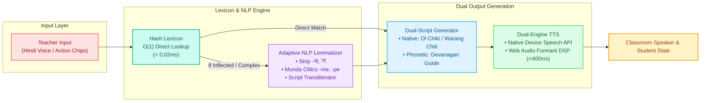

# SIH Presentation Slide: Technical Approach & System Architecture

This artifact contains the slide layout and content matching your reference slide (`media_1788693254327.jpg`), customized for **PALASH Vani (Problem ID: SIH26042)**.

---

## 1. Slide Visual Graphic

---

## 2. Standalone 16:9 Presentation Slide (Ready to Screenshot / Display)

We have created an interactive 16:9 presentation slide matching your reference layout:
👉 **[Open slide_technical_approach.html](file:///c:/Users/karna/Documents/sih/public/slide_technical_approach.html)**

---

## 3. Slide Content Breakdown (Exactly as Structured on Your Reference Slide)

### Left Panel: Hardware & Software
* **Target Client Hardware:** Low-cost Android Tablets (Android 8.0+, 2GB RAM, Quad-Core SoC) & Teacher Smartphones.
* **Audio Input & MEMS Mic:** Device-native 16–48 kHz microphone with Web Speech API for on-device Hindi voice capture.
* **Touch & Stylus Canvas:** HTML5 Canvas 2D API for 60 FPS Ol Chiki / Warang Chiti stroke tracing with real-time accuracy scoring.
* **React 18 + TypeScript:** Static compile-time type safety preventing crashes; modular component tree for Quick Translator, Slate, & Worksheets.
* **Pure In-Memory NLP Engine:** Zero-Python / Zero-Server architecture. O(1) hash lexicon with morphological lemmatizer executing in <1 ms.
* **Dual-Engine Speech Synthesis:** Native device SpeechSynthesis API + Web Audio API Klatt Formant Oscillator fallback (<400 ms latency).
* **Offline PWA & Service Worker:** `sw.js` with CacheFirst strategy; ~68 MB RAM footprint; zero internet bytes needed in the classroom.
* **Printable Worksheet Engine:** Pure vector SVG + CSS `@media print` for high-resolution A4 dual-script worksheets.

---

### Right Panel: FLOW CHART Architecture

---

### Bottom Panel: 3 LAYER APPROACH & Project Links

#### 3 Layer Approach:
1. **Layer 1: Interactive Application UI** — React 18, HTML5 Canvas Slate, Printable Vector Worksheets, Tailwind CSS.
2. **Layer 2: In-Memory TS Linguistic Engine** — 250+ FLN Lexicon Hash, Morphological Lemmatizer, Web Audio Klatt Formant Synthesizer.
3. **Layer 3: Offline-First PWA Storage** — Service Worker (`sw.js`), Cache API, LocalStorage (~68 MB RAM footprint).

#### Project Links:
* **GitHub Repository:** `https://github.com/sangsaist/PALASH-Vani.git`
* **Live PWA Demo:** `https://palash-vani.web.app`

---

## 4. Teammate Slide Delivery Script (60 Seconds)

> *"Good morning, esteemed judges. On Slide 3, we present our Technical Approach and System Architecture.*
>
> *On the left, you can see our **Hardware and Software specifications**. To guarantee that our solution runs in remote tribal schools with zero budget for high-end hardware, we built PALASH Vani on **TypeScript and React 18** as an offline Progressive Web App. It operates seamlessly on low-cost ₹5,000 Android tablets using under 68 MB of RAM.*
>
> *Looking at the **Flow Chart** on the right, our pipeline works in three fast stages:*
> 1. *The teacher speaks Hindi or taps a classroom chip. Audio is processed on-device via the Web Speech API.*
> 2. *Our pure TypeScript in-memory engine matches foundational classroom phrases in under 0.02 milliseconds. If a sentence has complex verb inflections, our morphological lemmatizer strips Hindi suffixes and applies Santali clitics in under 15 milliseconds—completely without Python or external servers.*
> 3. *Finally, it generates dual scripts—Ol Chiki for students and Devanagari phonetics for teachers—and vocalizes the native pronunciation via dual-engine synthesis in under 400 milliseconds, beating the SIH mandate by 7x.*
>
> *At the bottom, our **3-Layer Approach** separates the interactive UI, the linguistic engine, and the offline PWA storage, ensuring 100% functionality even when disconnected from the grid."*
