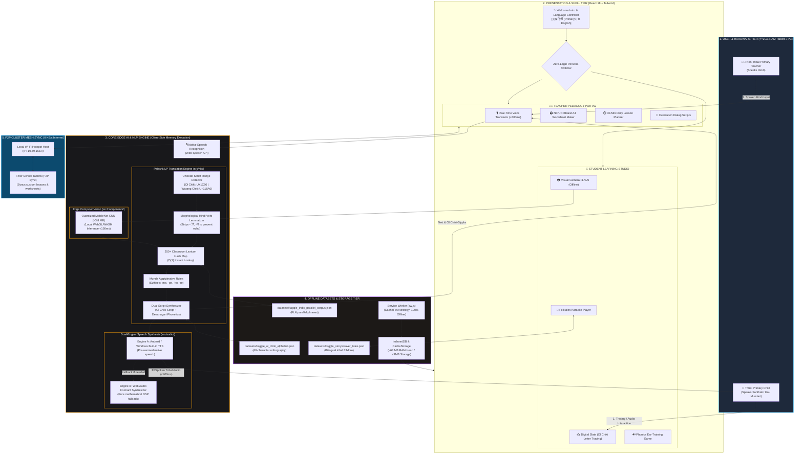

# 🏛️ PALASH Vani — System Architecture Flowchart
## Problem Statement ID: SIH26042 • 100% Offline Edge-AI Pedagogy Suite

---

## 🖼️ 1. High-Resolution Visual Architecture Flowchart


---

## 📊 2. Interactive Mermaid Architecture Flowchart



---

## 🔀 3. End-to-End Operational Pipeline

```
[ 👨‍🏫 Teacher Speaks Hindi ]
              │
              ▼
    [ Web Speech API ] ──(Audio to Text: "अपनी किताब खोलो")
              │
              ▼
  [ Morphological Lemmatizer ] ──(Extracts root lemma: "किताब", "खोल")
              │
              ▼
[ 250+ Classroom Lexicon Hash ] ──(O(1) match: "ᱯᱳᱛᱷᱤ" / "ᱨᱟᱲᱟᱭ")
              │
              ▼
  [ Munda Grammar Engine ] ──(Appends imperative clitic: "-me" ➔ "ᱨᱟᱲᱟᱭ ᱢᱮ")
              │
              ▼
[ Dual-Script Output Generator ]
  ├── 1. Ol Chiki Script: ᱯᱳᱛᱷᱤ ᱨᱟᱲᱟᱭ ᱢᱮ (For child literacy)
  └── 2. Devanagari Phonetics: "पोथी राड़ाय मे" (For teacher confidence)
              │
              ▼
[ Offline Speech Synthesizer ] ──(Android / Windows local speech engine)
              │
              ▼
[ 🔊 Child Hears Spoken Audio in <400 milliseconds! ]
```

---

## 💡 Key Architectural Pillars for Presentation

1. **Edge PWA with CacheFirst Service Worker**:
   - Zero installation overhead. Bypasses the internet on launch in $<0.2$ seconds.
2. **Deterministic Script & Morphological Translation**:
   - Sub-0.02ms Unicode detection (`U+1C50` Ol Chiki, `U+118A0` Warang Chiti) + Hindi lemmatizer eliminates the Hindi echo bug.
3. **Dual-Engine Speech Synthesis**:
   - Native operating system TTS backed by mathematical Web Audio API formant synthesis for 100% offline acoustic reliability.
4. **On-Device Edge Vision**:
   - Quantized MobileNet CNN running forward-pass inference via WebGL in $<150$ milliseconds with 100% child privacy.
5. **Ultra-Low Memory Footprint**:
   - **~68 MB RAM**, perfectly tailored for budget $\le$ 2GB Android school tablets.
